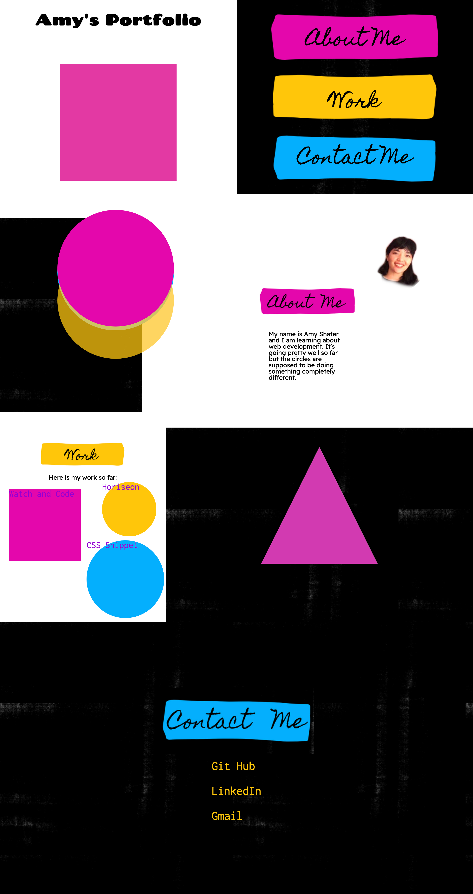

# Amy Shafer's Portfolio

This website is Amy Shafer's Portfolio. It's a pretty rad place on the internet!

The website was made from scratch with considerable help from Google for the shape animation. You can find citation for the animations and other fun tidbits below:

## Table of contents
* [Technologies](#technologies)
* [Mockup](#mockup)
* [Resources-used](#resources-used)
* [Future-plans](#future-plans)
* [Github-url](#github-url)
* [Deployed-url](#deployed-url)

## Technologies

This website was built and refactored using HTML and CSS.

Users do not need setup.

## Mockup

The following image shows the website is action!

## Resources-used

* <a href="https://css-tricks.com/the-shapes-of-css/" target="_blank_">How to make various shapes in CSS</a> 

* <a href="https://codepen.io/nwolke/pen/pvLjro" target="_blank_">How to rotate a square(and a triangle)</a> 

* <a href="https://www.canva.com/" target="_blank_">Design inspiration came from the website Canva</a> 

## Future-plans

In the future, all the shape animation will be improved. The timing of the squares and the triangles will be tweaked. Presently, the circle animation is comically different from the intial plan.

The links in the Work section, aesthetically and content-wise are both elements that will be revisited. 

An animation feature will be added to the Contact Me section although more precise details are not yet decided.

---

## Github-url
<a href="https://github.com/AmyShafer/Amy-U-Shafer-Portfolio" target="_blank_"> Amy Shafer's Portfolio Repository </a> 

## Deployed-url
<a href="https://amyshafer.github.io/Amy-U-Shafer-Portfolio/" target="_blank_"> Amy Shafer's Portfolio Deployment URL </a> 

