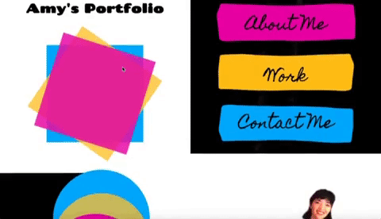

# Amy Shafer's Portfolio

This website is Amy Shafer's Portfolio. It's a pretty rad place on the internet!

The website was made from scratch with considerable help from Google for the shape animation. You can find citation for the animations and other fun tidbits below:

## Table of contents
* [Technologies](#technologies)
* [Mockup](#mockup)
* [Resources-used](#resources-used)
* [Future-plans](#future-plans)
* [Github-url](#github-url)
* [Deployed-url](#deployed-url)
* [Author](#author)
* [Licensing](#licensing)

## Technologies

This website was built and refactored using HTML and CSS.

Users do not need setup.

## Mockup

The following image shows the website is action!

## Resources-used

* <a href="https://css-tricks.com/the-shapes-of-css/" target="_blank_">How to make various shapes in CSS</a> 

* <a href="https://codepen.io/nwolke/pen/pvLjro" target="_blank_">How to rotate a square(and a triangle)</a> 

* <a href="https://www.canva.com/" target="_blank_">Design inspiration came from the website Canva</a> 

## Future-plans

In the future, all the shape animation will be improved. The timing of the squares and the triangles will be tweaked. Presently, the circle animation is comically different from the intial plan.

The links in the Work section, aesthetically and content-wise are both elements that will be revisited. 

An animation feature will be added to the Contact Me section although more precise details are not yet decided.

---

## Github-url
<a href="https://github.com/AmyShafer/Amy-U-Shafer-Portfolio" target="_blank"> Amy Shafer's Portfolio Repository </a> 

## Deployed-url
<a href="https://amyshafer.github.io/Amy-U-Shafer-Portfolio/" target="_blank"> Amy Shafer's Portfolio Deployment URL </a> 

## Author

This application was created by Amy U. Shafer. You can reach her at Amy.U.Shafer@gmail.com ✨

## Licensing 

MIT License

Copyright (c) 2022 Amy U. Shafer

Permission is hereby granted, free of charge, to any person obtaining a copy
of this software and associated documentation files (the "Software"), to deal
in the Software without restriction, including without limitation the rights
to use, copy, modify, merge, publish, distribute, sublicense, and/or sell
copies of the Software, and to permit persons to whom the Software is
furnished to do so, subject to the following conditions:

The above copyright notice and this permission notice shall be included in all
copies or substantial portions of the Software.

THE SOFTWARE IS PROVIDED "AS IS", WITHOUT WARRANTY OF ANY KIND, EXPRESS OR
IMPLIED, INCLUDING BUT NOT LIMITED TO THE WARRANTIES OF MERCHANTABILITY,
FITNESS FOR A PARTICULAR PURPOSE AND NONINFRINGEMENT. IN NO EVENT SHALL THE
AUTHORS OR COPYRIGHT HOLDERS BE LIABLE FOR ANY CLAIM, DAMAGES OR OTHER
LIABILITY, WHETHER IN AN ACTION OF CONTRACT, TORT OR OTHERWISE, ARISING FROM,
OUT OF OR IN CONNECTION WITH THE SOFTWARE OR THE USE OR OTHER DEALINGS IN THE
SOFTWARE.

